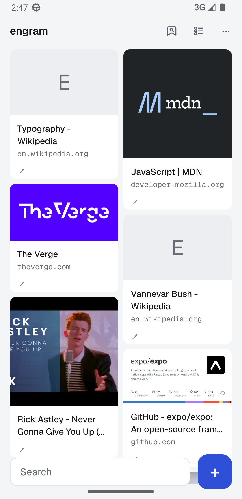
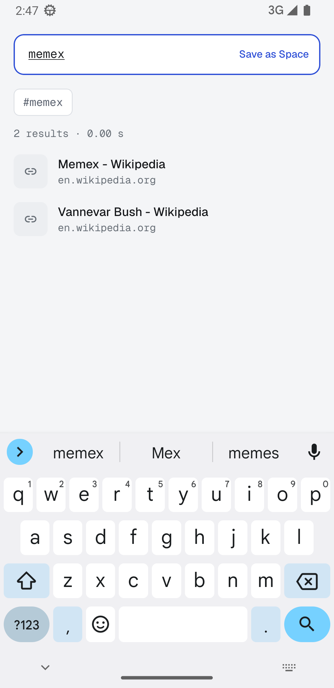
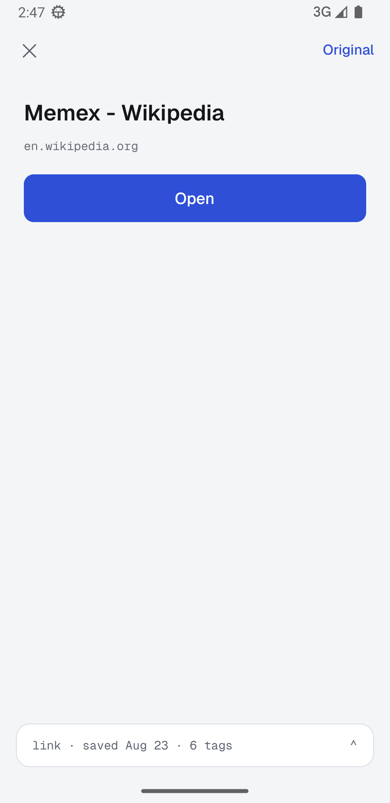
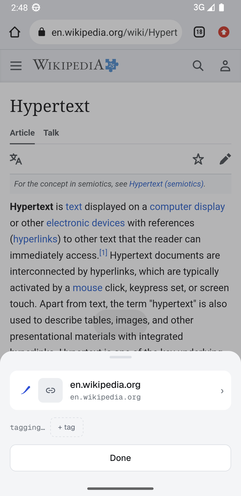
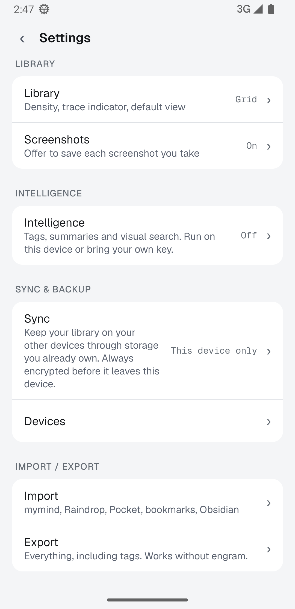

<p align="center">
  
</p>

<h1 align="center">engram</h1>

<p align="center">Remember everything. Own everything.</p>

engram is a place to keep the things you find: links, articles, images, notes, quotes, screenshots, files. You save something in one tap and find it again by searching the way you remember it ("that blue chair", "the article about sleep"). The app tags what you save on its own, and you never have to file anything.

It is a free, open source answer to apps like mymind, with two differences that matter. Everything you save stays on your device, in a SQLite database you can export at any time. And the AI is yours to choose: paste an API key for Anthropic, OpenAI, Gemini or OpenRouter, point it at Ollama or LM Studio on your own machine, or run a small model on the phone itself. There is no account and no server of ours anywhere in the picture.

<p align="center">
  
  
  
  
  
</p>

## What it does

**Save from anywhere.** Share a link, image or text from any app and a small sheet appears over the app you came from. The card folds into the trace mark, you see "Saved", and you can add tags or put it in a Space without leaving what you were doing. Inside engram you can paste from the clipboard, pick photos or files, point the camera at something, or write a note.

**Tags without a model.** Every save gets tags on its own: proper nouns and repeated terms from the page, text read out of images, the site it came from, and any tag you already use that matches. With Intelligence turned on, the model you chose adds richer tags, a short summary, and semantic search on top. Tags the model adds look and behave like your own.

**Search that reads the whole page.** Articles are saved with their full text and indexed, so a search finds the word inside the piece and not only in the title. Operators narrow things down: `tag:`, `type:`, `site:`, `text:`, `before:`, `after:`, quoted phrases, and `-` to exclude. Press Enter to turn a term into a chip and keep typing. A search you want to keep becomes a Space.

**Screenshots.** On Android, turn on *Watch for screenshots* and every screenshot you take shows a quiet banner asking whether to keep it. Tap Save and the same sheet opens with the image. iOS cannot watch in the background; engram offers to save a screenshot taken while the app is open.

**Resurface.** Cards you have not opened in a while come back a few at a time. Strengthen the ones that still matter and let go of the rest. Letting go keeps a card for 30 days, and an Undo is one tap (or one shake) away.

**Sync through storage you already own.** Link a second phone by scanning a code and your library syncs through your Google Drive, iCloud Drive, or any WebDAV server. Everything that leaves the device is encrypted first with a key only you hold, written down as a 12 word recovery phrase. The provider sees file sizes and timestamps and nothing else.

**Leave whenever you like.** Export is a zip with your original files, a JSON file, a CSV that includes every tag and summary, and a folder of markdown notes you can drop into Obsidian. Import takes a mymind export, Raindrop and Pocket CSVs, browser bookmarks, and markdown folders.

## Install the app

Builds are published on the [Releases](../../releases) page. The Android APK is signed with the Expo debug keystore, which is fine for sideloading. The iOS build is unsigned; install it with a tool that signs on install, such as AltStore or Sideloadly.

Expo Go cannot run engram. The app uses native modules (SQLite with full text search, the share activity, OCR, the screenshot watcher), so it needs a real build.

## Build it yourself

You need Node 22 and pnpm 9. Android also needs the Android SDK with platform 36 and build tools, a JDK (17 or newer), and `ANDROID_HOME` set. iOS needs a Mac with Xcode.

```sh
pnpm install
pnpm typecheck       # every package
pnpm test            # core tests, including the sync convergence fuzz

pnpm android         # prebuild, compile the dev client, install it on the connected device or emulator, start Metro
pnpm start           # later runs: Metro only, the installed dev client reconnects
pnpm ios             # same on a Mac
```

Without a Mac, `cd apps/mobile && eas build -p ios --profile development` builds the iOS client in the cloud. The `development`, `preview` and `production` profiles are in `apps/mobile/eas.json`.

The *Build App* workflow under Actions builds release binaries on GitHub's runners and publishes them as a release. Run it from the Actions tab, pick a platform, and optionally give the release a tag.

## How the code is laid out

| Path | Package | Contents |
|---|---|---|
| `packages/core` | `@engram/core` | Pure TypeScript with no React Native, DOM or Node imports: the schema and migrations, the op-log database layer with per-field last-writer-wins, encryption, sync engine and storage adapters, search, content extraction, the AI provider layer and job queue, import and export. |
| `packages/db-rn` | `@engram/db-rn` | The React Native side of the `Platform` interface: op-sqlite, the secure key store, the content-addressed file store, the iCloud adapter. |
| `apps/mobile` | `mobile` | The Expo app. Routes live in `app/`, features in `src/features/`, and `src/lib/engram.ts` assembles the platform, the database, the job queue and sync into one object the screens use. Native pieces live in `modules/` (OCR, screenshot watcher) and `plugins/` (the translucent share activity). |

Every device keeps a full copy of the database. Changes are written as an append-only log of encrypted cells, pushed to the storage you chose, and merged on other devices by comparing hybrid logical clocks per field. There is no CRDT library and no coordination server; the remote only needs to support "create if absent" and "list". The fuzz test in `packages/core/test/sync.fuzz.test.ts` runs several simulated devices through random edits, partitions and clock skew and checks that they all end up identical.

`packages/core/src/model/schema.sql` is the source of truth for the schema. `pnpm --filter @engram/core gen:schema` regenerates the TypeScript copy.

## Made by

[Aditya S](https://xditya.me) · [GitHub](https://github.com/xditya) · [Buy me a coffee](https://buymeacoffee.com/xditya)

Licensed under AGPL-3.0.
